时隔五年，博主终于换电脑了！\
从`惠普星book14`换成了`ThinkBook 16p`，这俩不能说是毫厘不爽，只能说是天壤之别。个人感觉还是比较有纪念意义的，准备简单测评一下。\
我购买的版本是`Ultra9-275HX 32G 1T RTX5060 2.5K`的版本，国补后一万出头。锐龙版虽然便宜一些，但是全方面都略有阉割：砍掉了全金属机身、无人脸识别和指纹，网卡和扬声器也比酷睿版差一些，雷电接口也没有了。\
到手后开箱长这样，非常朴素，除了笔记本本体、充电器、说明书、保修卡外什么都没有。
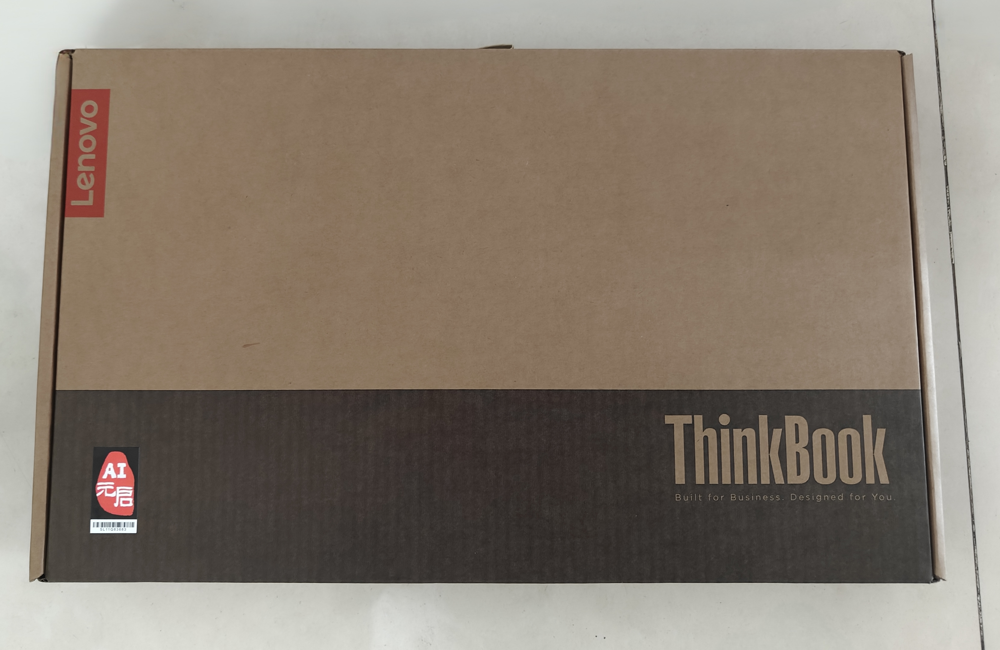
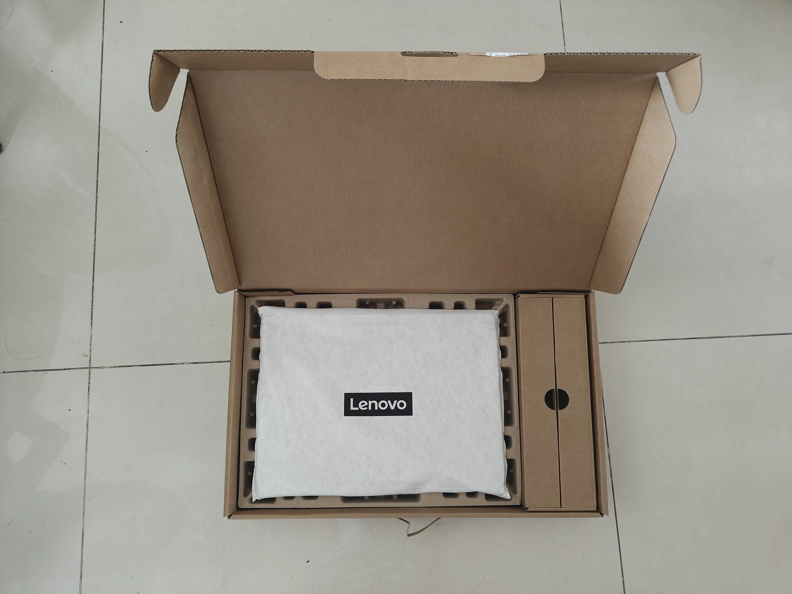
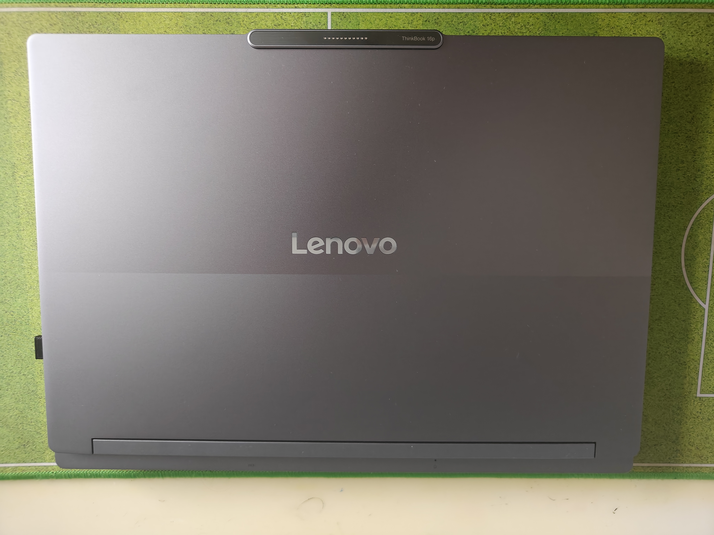
开箱后简单检查了一下，确认外观没有划痕、转轴没有卡顿或异响、键盘和触摸板可以正常回弹。\
开机直接上图吧工具箱
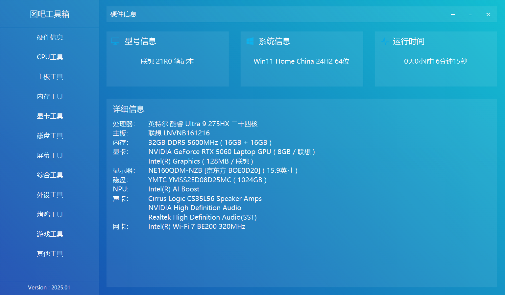
首先aida64和甜甜圈烤机，烤了20多分钟，温度和电压没什么异常。\
然后看硬盘，通电次数、通电时间和写入都在正常范围内。
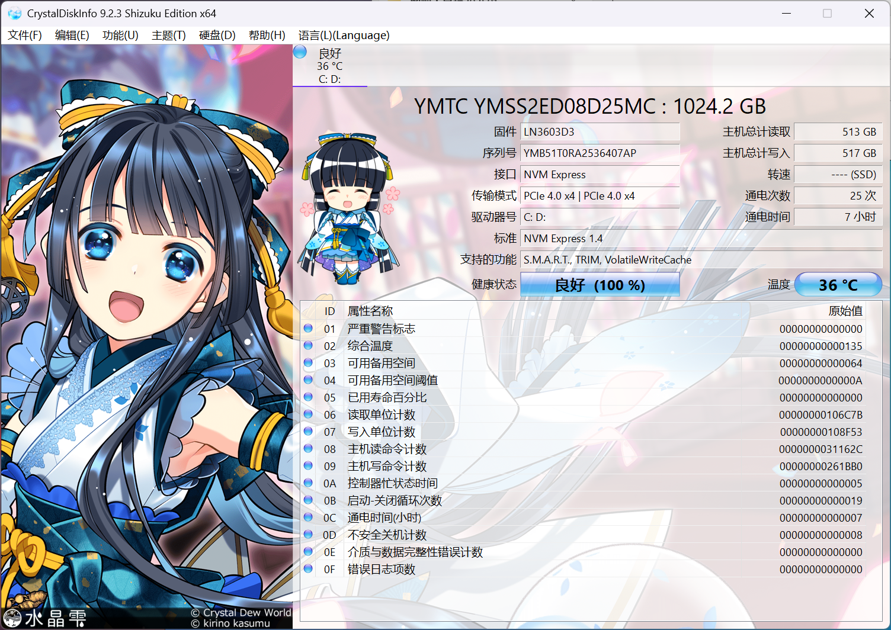
读写能力也还不错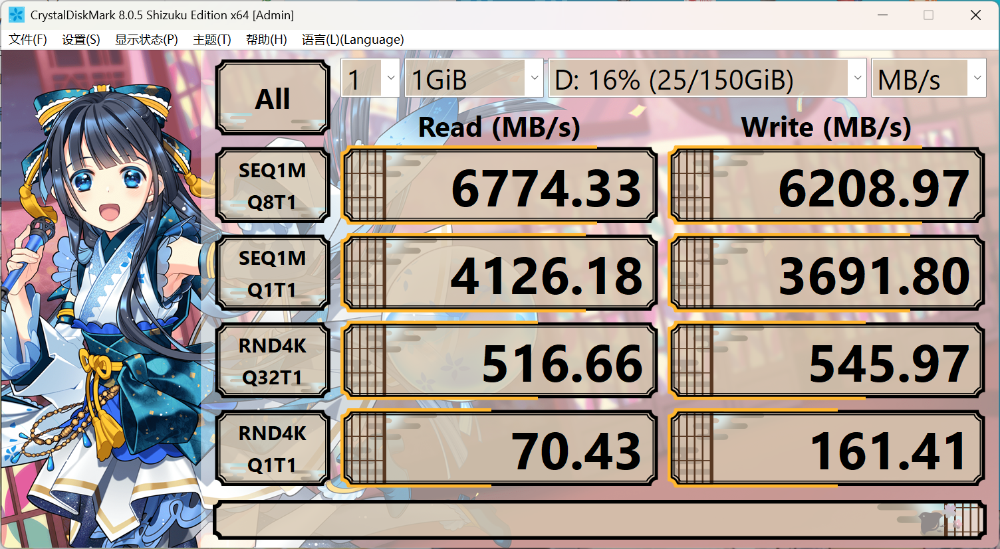
最后测个跑分\
Cinebench R23数据一般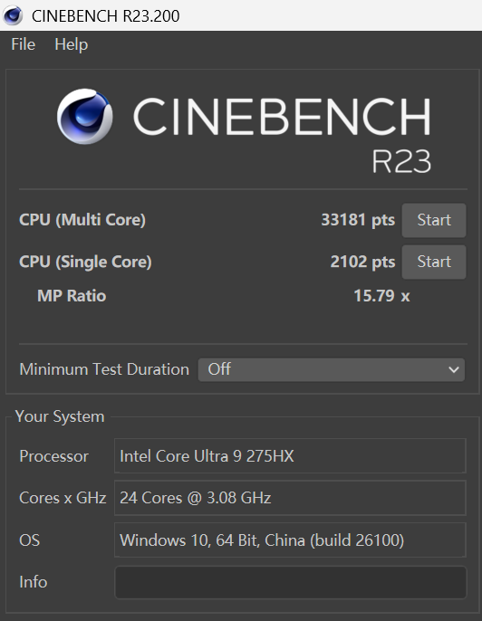
3DMark数据还不错
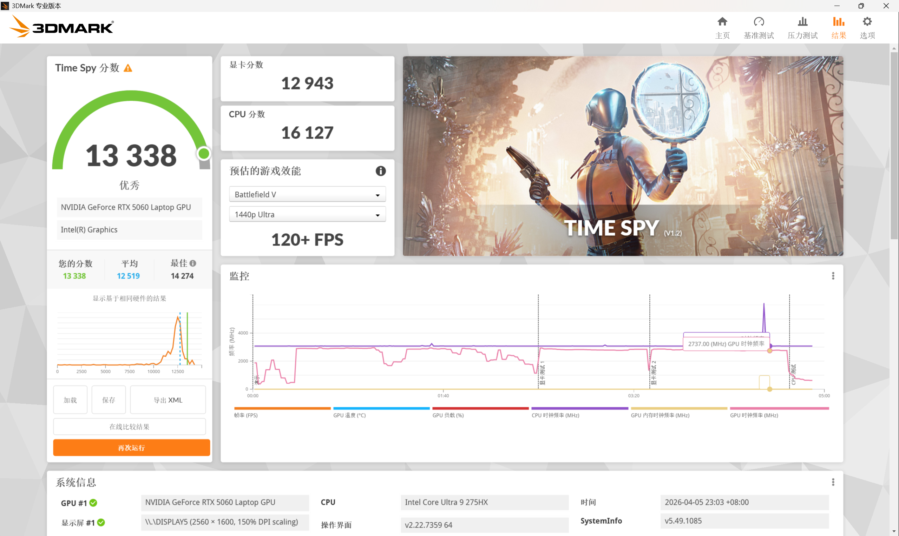

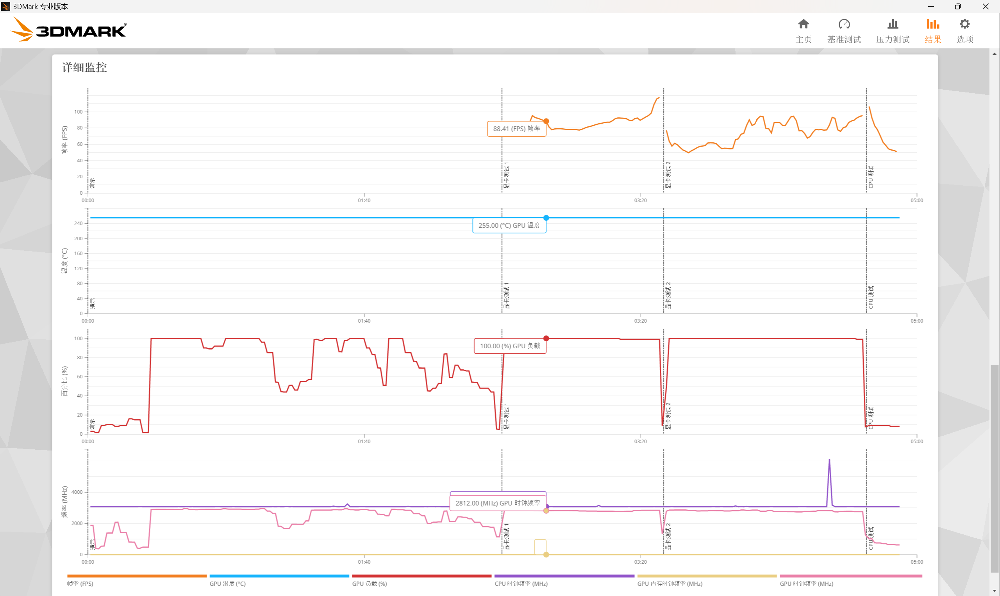
总体来说，没太大缺点，整体配置也很舒服。\
首先是接口，电脑左侧有两个雷电4、一个USB3.2Gen2和一个3.5mm耳机口。右侧有两个USB3.2Gen1和一个SD卡槽。后侧是电源接口和HDMI2.1。\
然后屏幕素质比较高，2.5K+240Hz+P3广色域，办公、游戏、看视频都很舒服。\
全金属机身，总重2.1kg，手感不错的同时不会像游戏本一样很重。\
最后它的性能也不错，虽然定位是全能办公本，但游戏能力也很强，整机性能释放最高200W。\
我个人认为比较明显的缺点，是它的电源适配器比较重，跟块黑砖似的，放包里又沉又占地方。不过不玩游戏纯办公的话，C口的PD充电应该也够用。
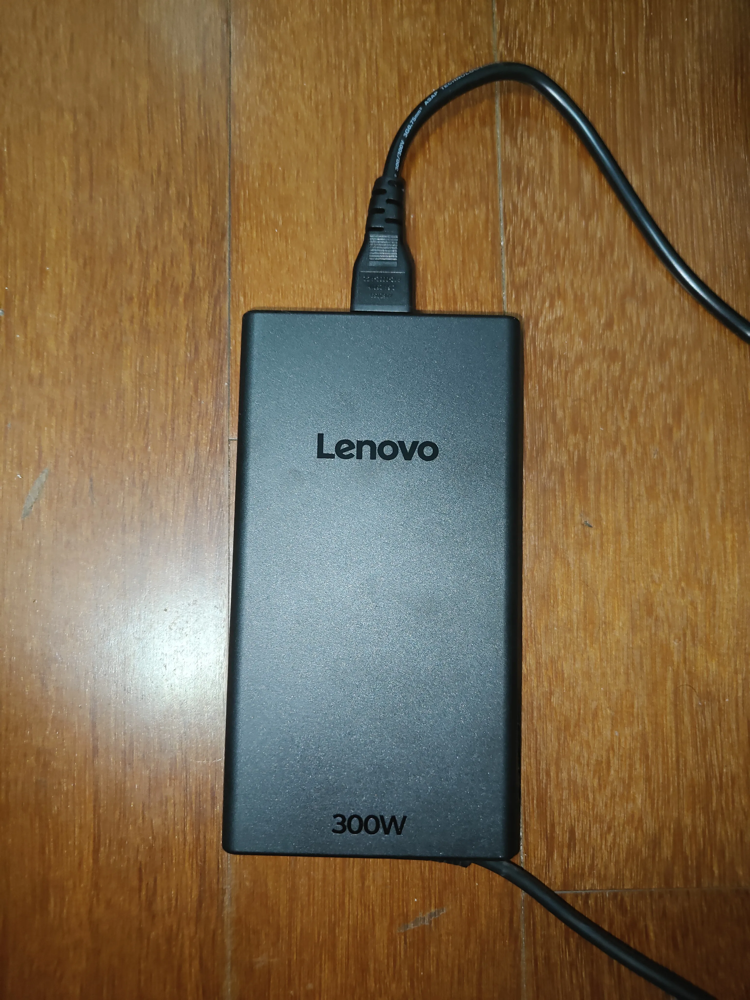
最后放张放在桌面上的展开图
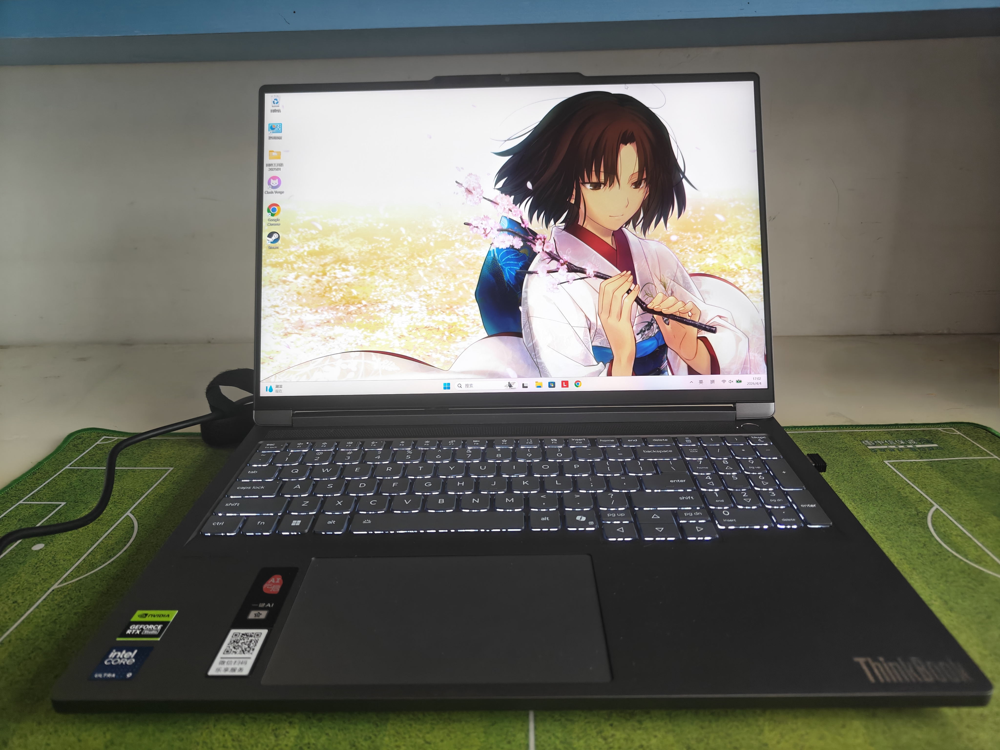