- [一、准备工作](#一准备工作)
- [二、开刷](#二开刷)
  - [1.长按音量下键和电源键进入fastboot](#1长按音量下键和电源键进入fastboot)
  - [2.twrp](#2twrp)
  - [3.清除数据](#3清除数据)
  - [4.刷入ROM](#4刷入rom)
    - [①喜欢卡刷可以把卡刷包拷贝到内置储存后，在twrp中点击`安装`，选中卡刷包进行刷入。](#喜欢卡刷可以把卡刷包拷贝到内置储存后在twrp中点击安装选中卡刷包进行刷入)
    - [②喜欢线刷可以使用侧载](#喜欢线刷可以使用侧载)
- [三、基础工作](#三基础工作)
  - [1.获取root权限(以Magisk为例)](#1获取root权限以magisk为例)
  - [2.安装LSPosed](#2安装lsposed)
- [四、展示](#四展示)
  - [锁屏](#锁屏)
  - [桌面](#桌面)
  - [UI](#ui)
  - [动画](#动画)
  - [充电](#充电)
  - [Infinity](#infinity)
由于MIUI过于垃圾，我的小米9使用MIUI12系统打开部分软件会有启动时间极长的问题，于是我准备将小米9刷成高版本类原生系统。\
我使用的是是`酷安大佬@巧克李`制作的`Project Infinity X`系统刷机包，版本为安卓16。\
教程适用于大部分高版本系统，除了PE等需要特殊twrp的系统。
# 一、准备工作
①准备好platform-tools、第三方recovery和卡刷包(线刷包直接在fastboot刷入即可)\
②确认USB驱动正常

谷歌从Android10开始引入了动态分区，所以从老系统升到高版本需要使用同时兼容动态分区和静态分区的twrp。\
我在这里提供一个mi9的twrp：<a href="https://raw.githubusercontent.com/GJMJimmy/Mizuki/refs/heads/master/public/files/TWRP-3.7.1_12-Unified-cepheus-20260204（合并动态分区和静态分区支持）.7z" download="TWRP-3.7.1_12-Unified-cepheus-20260204（合并动态分区和静态分区支持）.7z">点击下载</a>

# 二、开刷
## 1.长按音量下键和电源键进入fastboot

## 2.twrp
①如果rec不会被官方覆盖，直接刷入twrp
```
fastboot flash recovery "twrp.img文件路径"
```
刷入后长按音量上键和电源键进入recovery\
\
②如果rec会被官方覆盖，则临时启动twrp
```
fastboot boot "twrp.img文件路径"
```
## 3.清除数据
点击`清除`
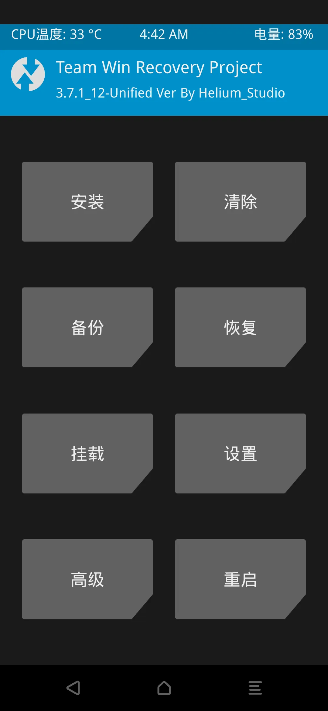
点击`高级清除`
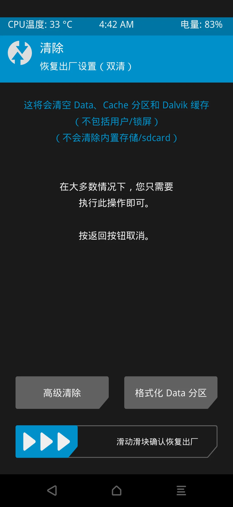
勾选以下`四项`进行清除
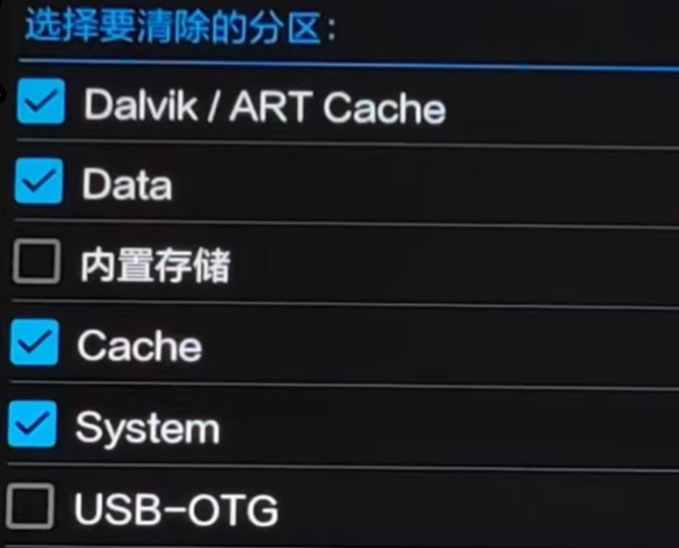
## 4.刷入ROM
### ①喜欢卡刷可以把卡刷包拷贝到内置储存后，在twrp中点击`安装`，选中卡刷包进行刷入。

### ②喜欢线刷可以使用侧载

在twrp主页点击`高级`->`ADB Sideload`
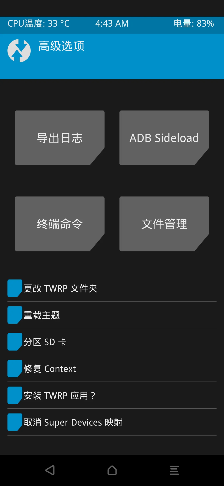
清除缓存后开始侧载
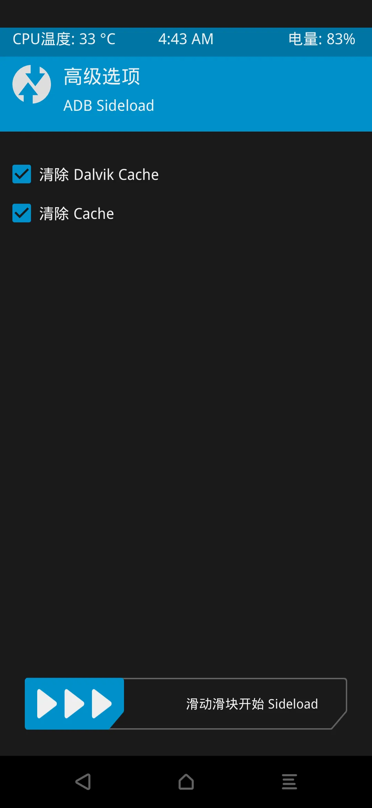
电脑用数据线连接手机后,执行命令：
```
adb sideload "卡刷包文件路径"
```
等待进度条完成即可
# 三、基础工作
## 1.获取root权限(以Magisk为例)
①在mi9上安装[Magisk](https://github.com/topjohnwu/Magisk/releases)\
②从刷机包中找到`boot.img`（如果有`init_boot.img`则使用init_boot.img）传入mi9
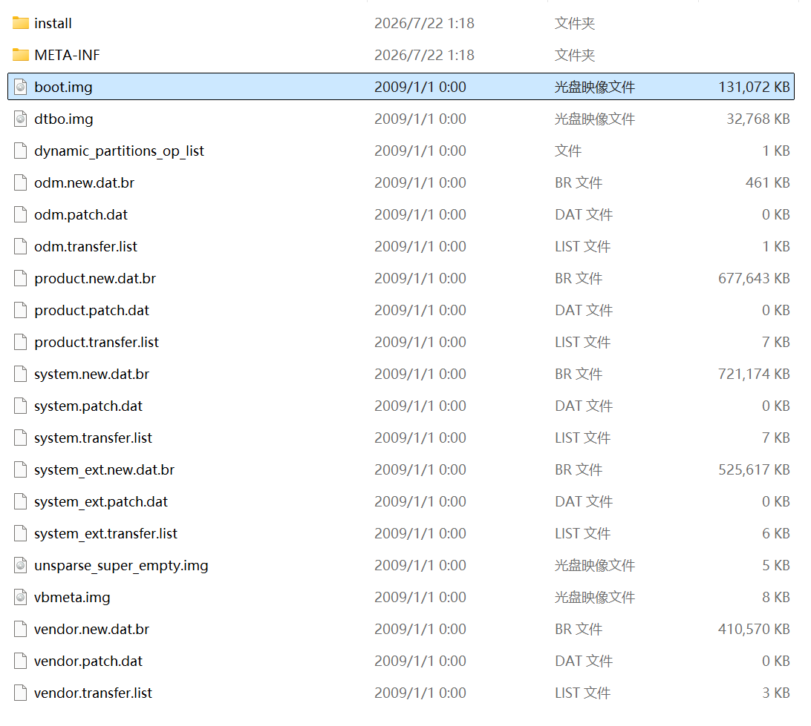
③在mi9使用Magisk修补后传回电脑
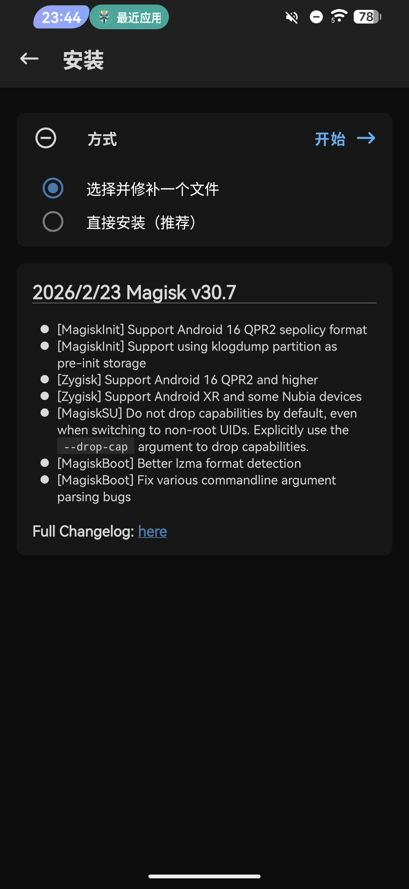
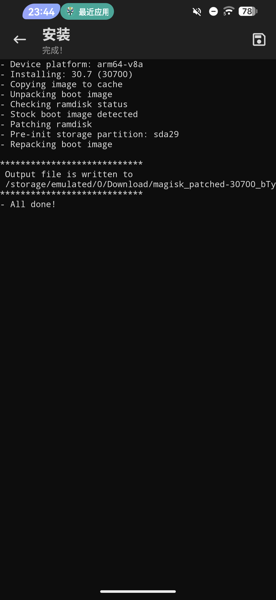
长按音量下键和电源键进入fastboot，执行命令刷写boot分区：
```
fastboot flash boot "修补boot.img文件路径"
```
如果有init_boot则刷写init_boot分区：
```
fastboot flash init_boot "修补init_boot.img文件路径"
```
## 2.安装LSPosed
Github上的LSPosed已经停止更新了，“最新版”1.9.2最高只支持到Android14
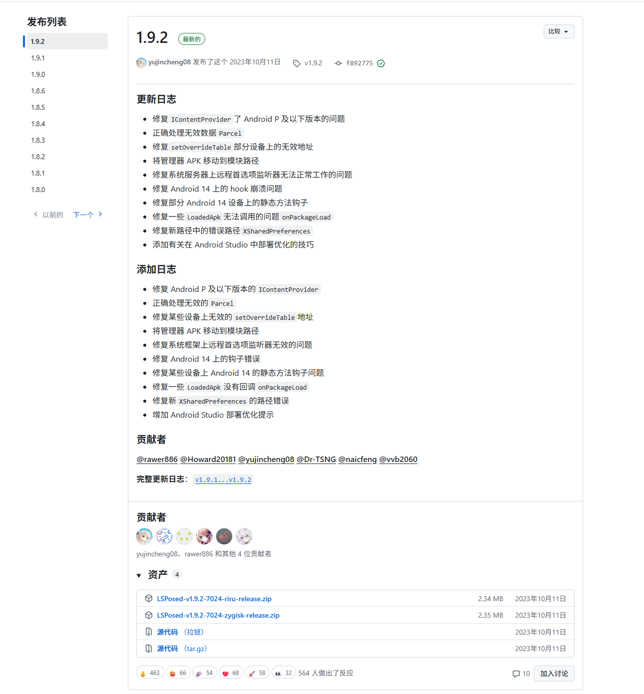
但实际上，作者只是从Github转去了TG频道
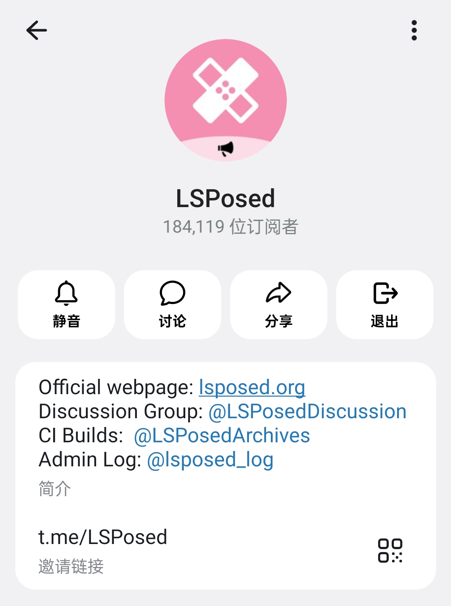
TG频道中目前最新的测试版2.1.1支持Android9-17\
<a href="/files/LSPosed-v2.1.1-7790-release.zip" download="LSPosed-v2.1.1-7790-release.zip">点击下载</a>
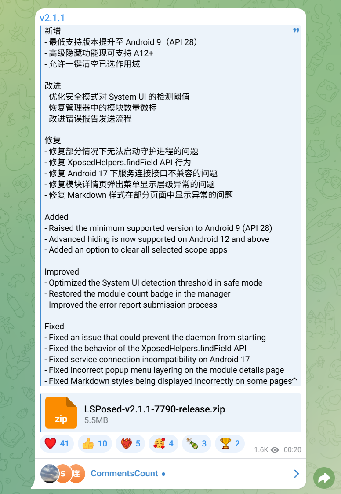
在Magisk中安装即可
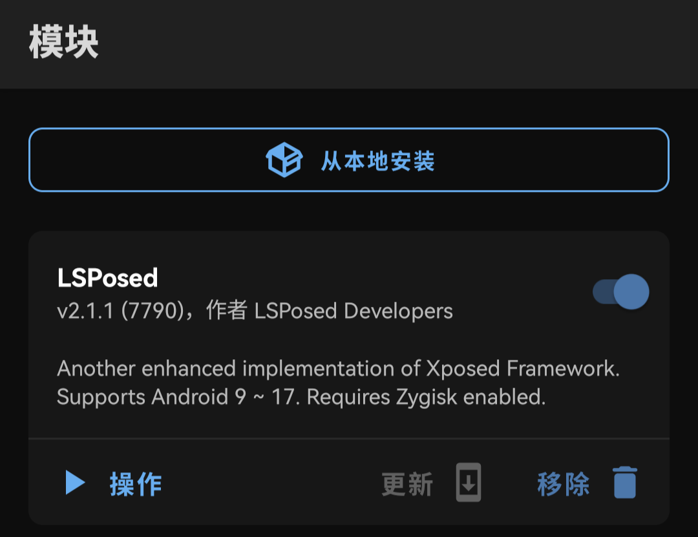
# 四、展示
PS:由于是gif图，帧率比较低
## 锁屏

## 桌面

## UI

## 动画

## 充电


## Infinity
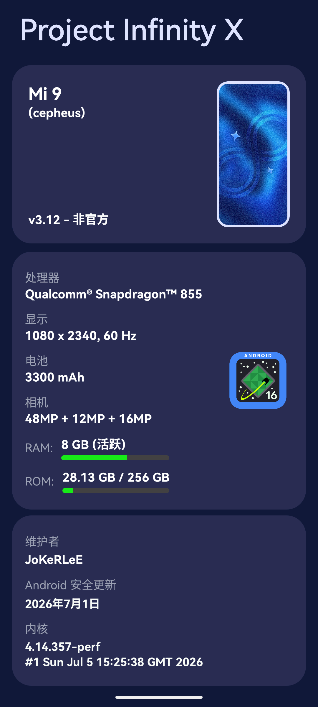
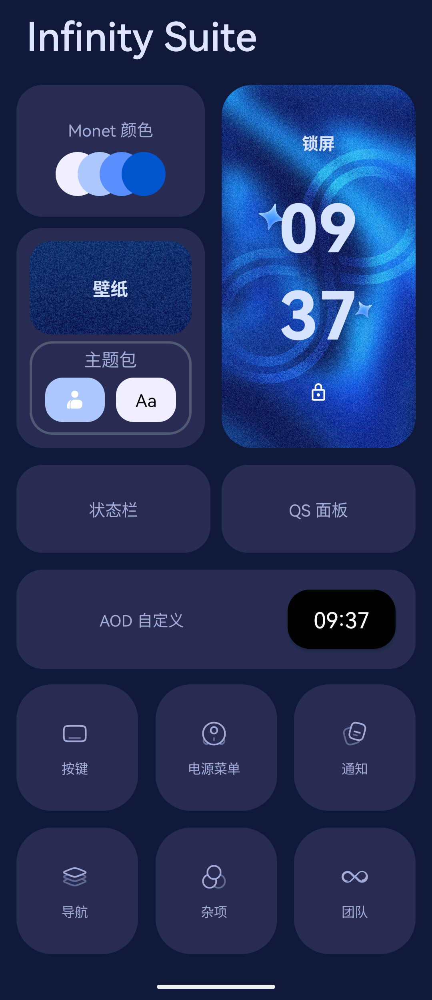