- [介绍](#介绍)
- [一、下载项目](#一下载项目)
  - [1、使用Git下载(推荐)](#1使用git下载(推荐))
  - [2、在浏览器下载](#2在浏览器下载)
- [二、准备工作](#二准备工作)
  - [1、安装nodejs](#1安装nodejs)
  - [2、安装依赖](#2安装依赖)
- [三、添加游戏内容](#三添加游戏内容)
  - [1、删除代理](#1删除代理)
  - [2、添加游戏文本](#2添加游戏文本)
  - [3、添加游戏图片](#3添加游戏图片)
    - [①提取图片](#提取图片)
    - [②放大图片](#放大图片)
    - [③放入图片](#放入图片)
    - [④生成缩略图](#生成缩略图)
  - [4、添加声音](#4添加声音)
    - [①添加音乐](#添加音乐)
    - [②添加音效](#添加音效)
- [三、编译](#三编译)
# 介绍
玩过老版月姬的应该都知道，老版月姬的的游玩体验非常难受，比如UI很老、没有流程图、存档功能简陋…… \
\
但我对老版月姬实在是感兴趣，最后我找到了一位法国月丑大神制作的[月姬网页版](https://tsukiweb.holofield.fr/)，他把整个游戏系统都重做了一遍，优点如下：
-	1、加入了流程图、画廊、现代化的文本回放
-	2、整合了PLUS-DISC的内容
-	3、游戏音乐可以在原版、EVERAFTER、月箱这三版中自行选择
-	4、存档可以显示细节(章节、封面、当前页文本)
-	5、支持直接跳过已读章节
-	6、可以方便的导入导出存档及设置
-	7、整合了多语言 


但由于网站在国外，访问速度很慢，所以我想能不能自行在本地部署一个呢？欸，还真可以，这位大佬把游戏框架(不包含游戏内容)开源在了Github，根据Wiki教程我们可以自己重构一遍他的网站。\
\
有能力的可以直接去Github项目部署了：
::github{repo="requinDr/tsukiweb-public"}
没能力的可以跟着我下面的教程

# 一、下载项目
注意，由于该项目中有子模块，所以不可以直接下载release版本
## 1、使用Git下载(推荐)
先打开[项目地址](https://github.com/requinDr/tsukiweb-public)复制HTTPS/SSH链接

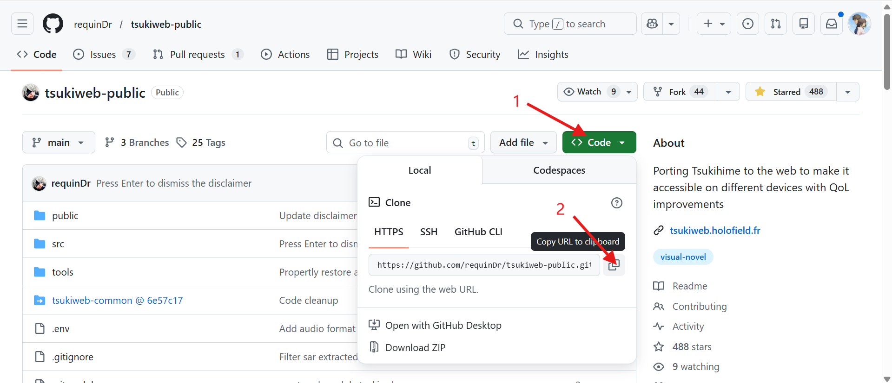

在你想要部署项目的目录下打开CMD或GitBash，输入`git clone --recursive <链接>`，回车
图省事直接复制下面的也行

注：`--recursive`参数用于将子模块一并下载
```
 git clone --recursive https://github.com/requinDr/tsukiweb-public.git
```
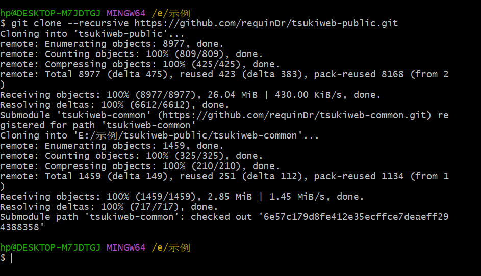
如图已经下载好了，进入目录tsukiweb-public/tsukiweb-common检查一下，如果有文件就没问题
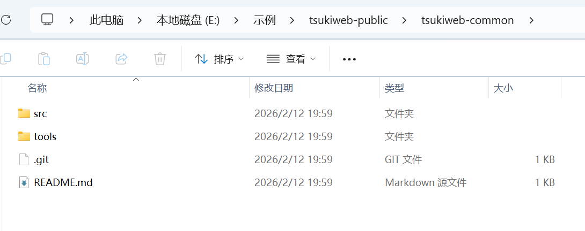
## 2、在浏览器下载
分别进入[tsukiweb-public](https://github.com/requinDr/tsukiweb-public)和子模块[tsukiweb-common](https://github.com/requinDr/tsukiweb-common)点击`Download ZIP`下载
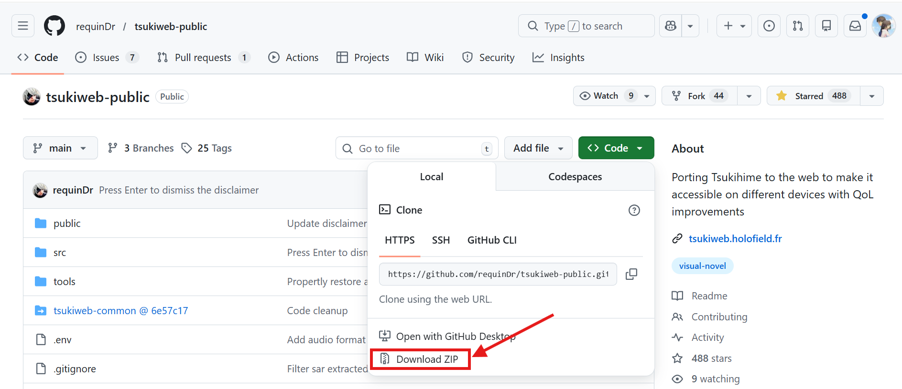
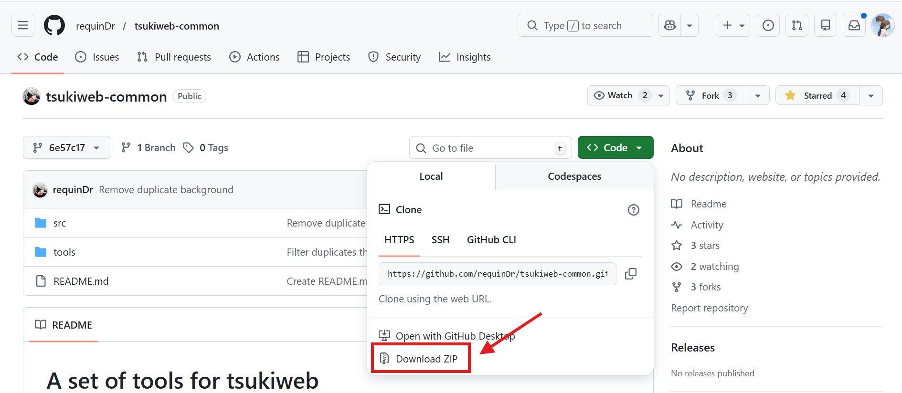
将两个压缩包分别解压
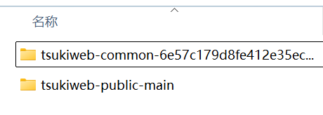
将名字中带有tsukiweb-common的文件夹改名为`tsukiweb-common`，移动到另一个文件夹根目录
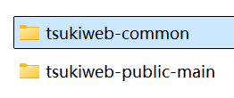
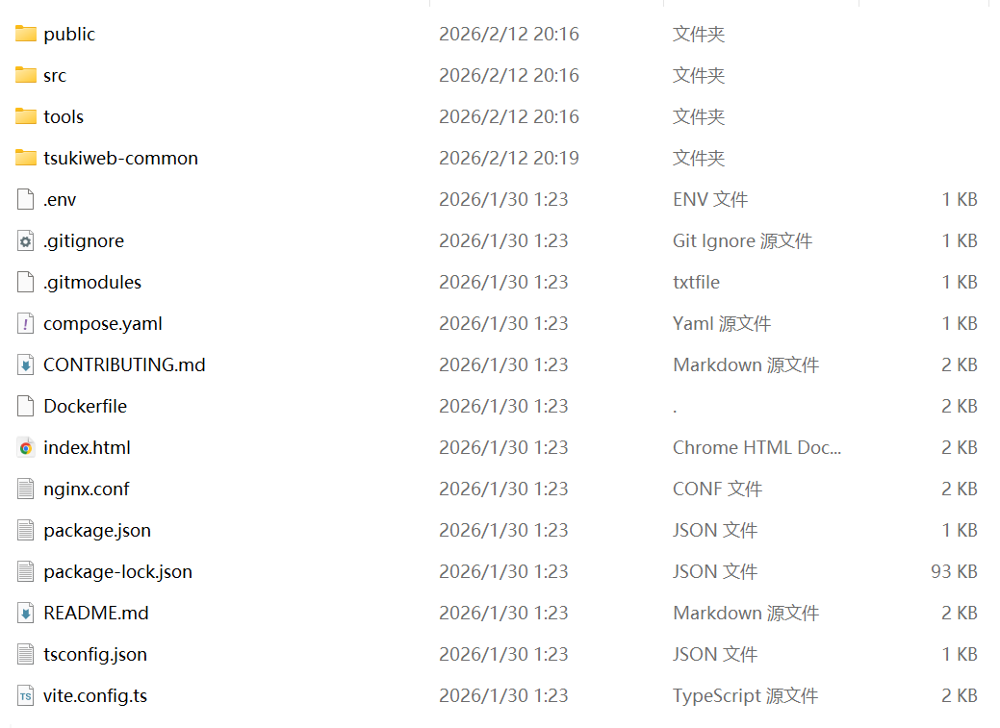

# 二、准备工作
## 1、安装nodejs
进入[nodejs](https://nodejs.cn/download/)官网，下载长期支持版本，并安装
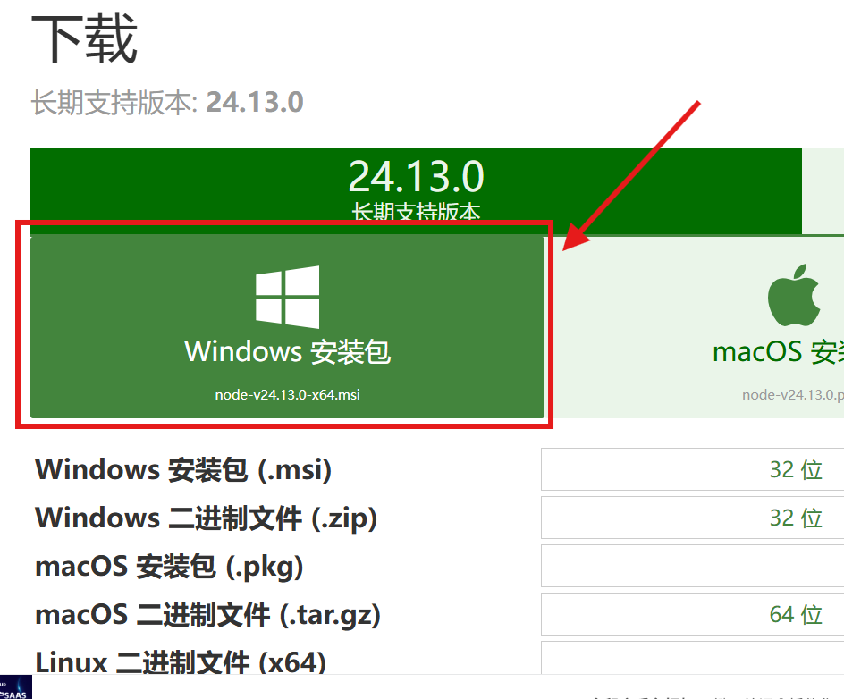
一直Next就行
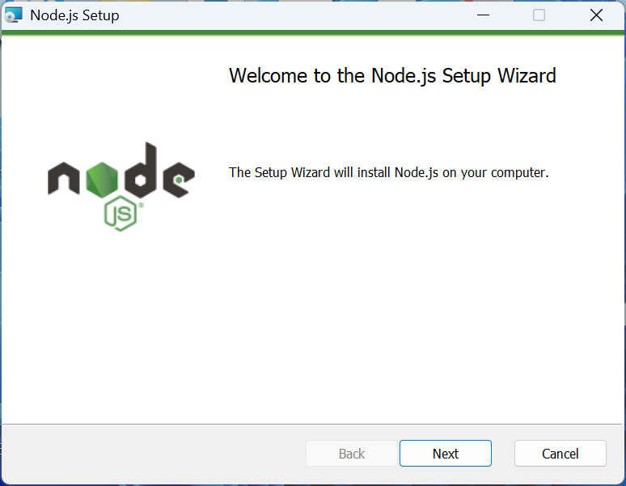
安装好后在命令行输入
```
npm -v
```
显示版本就成功了
## 2、安装依赖
在CMD里进入项目根目录，输入：
```
npm install
```
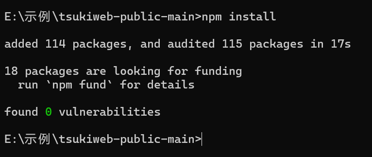
如图已经安装依赖成功，此时在根目录会生成`node_modules`文件夹

# 三、添加游戏内容
## 1、删除代理
打开根目录的文件`vite.config.ts`
将如图选中的`proxy块`内容删掉
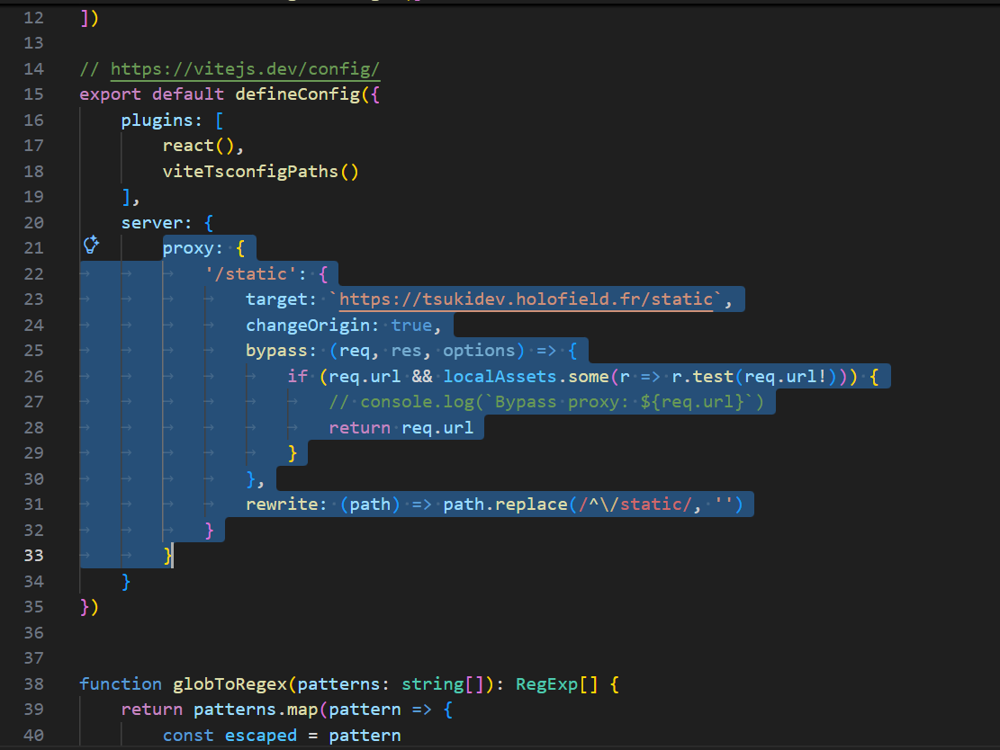
注：该代码块的作用是将所有获取游戏文件的链接从本地替换成项目作者的网站，以便在没有添加游戏内容时游玩，但我们要本地部署，所以删掉该代码块
## 2、添加游戏文本
先下载该链接的文件`fullscript_jp.txt`
```
https://tsukiweb.holofield.fr/static/jp/fullscript_jp.txt
```
可以用浏览器打开后按Ctrl+s保存，也可以直接用idm之类的下载器下载\
下载后将文件移动至`根目录/public/static/jp`中\
在CMD中进入`根目录/tools/convert-scripts`，输入指令回车：
```
node index.js
```
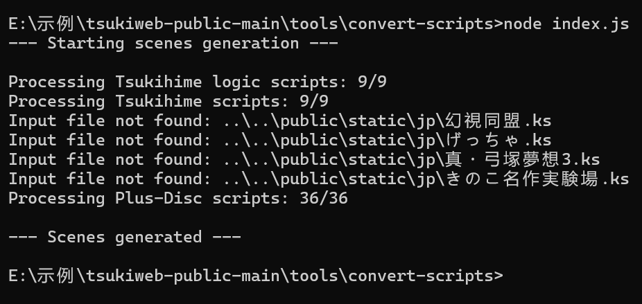
注：显示not found是因为jp(日语文本)文件夹中没有这四个文件，想看日语的可以自行添加，但缺少不影响中文
## 3、添加游戏图片
### ①提取图片
请先自行获取老版月姬的游戏文件，并将其根目录下名为`arc.nsa`的文件解包，教程可以参考我的这篇文章：<a href="/posts/extractdata/">解包Ons游戏文件中后缀为.nsa的资源文件</a>
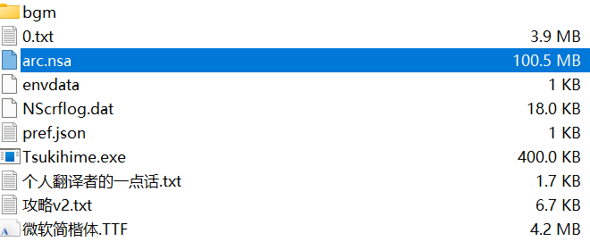
可以得到以下文件夹
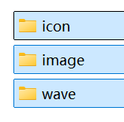
文件夹`icon`可以删掉，`image`文件夹内只需要保留`bg`、`event`和`tachi`，其它可以删掉
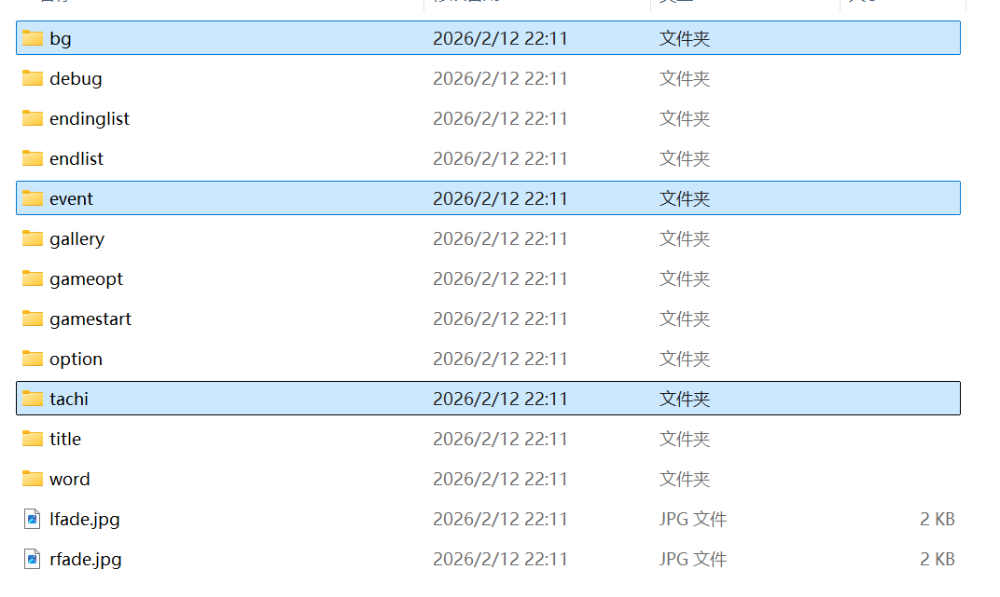
在`根目录/tools/transform-sprites`下创建`input`文件夹\
将`tachi`文件夹内的图片都移动进`input`中\
在`根目录/tools/transform-sprites`下打开CMD输入`node index.js`\
完成后得到`output`文件夹
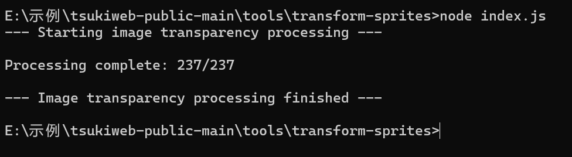
将处理完的`output`文件夹内的图片移动回`tachi`(tachi文件夹内只需要处理完的图片，不需要最开始提取的)

请自行获取月姬PLUS-DISC的游戏文件，同样解包其根目录下名为`arc.nsa`的文件，解包后得到的文件夹里只需要保留`bgimage`、`fgimage`、`sound`文件夹，其它都可以删了
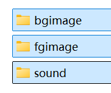
`bgimage`改名为`bg`\
`fgimage`改名为`tachi`
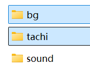
将文件夹`tachi`内名字带有`seo`的文件，改名为`arisa`
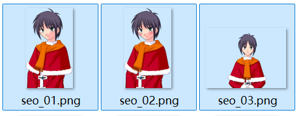
改名后↓
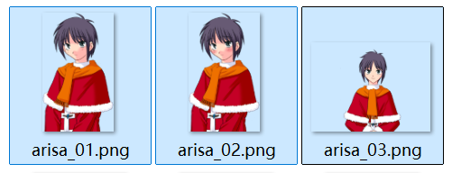
将这两个文件夹的内容分别合并到刚刚月姬本体提取出的对应文件夹，有重复文件直接跳过就行了
### ②放大图片
先下载超分工具[Waifu2x-caffe](https://github.com/lltcggie/waifu2x-caffe/releases)并解压\
在Waifu2x-caffe根目录创建名为`input`和`input_x2`的文件夹，将刚刚合并好的`bg`、`event`、`tachi`文件夹移入`input`文件夹

在Waifu2x-caffe根目录下打开CMD，输入以下指令：\
有独显用独显跑：
```
waifu2x-caffe-cui.exe -i "tools/convert-images/input" -o "tools/convert-images/input_x2" -m noise_scale -n 0 -s 2 -b 8 -p cudnn -model_dir models-cunet
```
没独显用CPU跑：
```
waifu2x-caffe-cui.exe -i "tools/convert-images/input" -o "tools/convert-images/input_x2" -m noise_scale -n 0 -s 2 -b 8 -p cpu
```

**接下来请耐心等待，如果没有独显将会跑的非常慢**\
PS:博主没有独显用cpu跑了5个小时
### ③放入图片
跑完后将文件夹`input`和`input_x2`移动到tsukiweb-public项目的`根目录/tools/convert-images`\
在该目录打开CMD，输入`node index.js`回车，等待完成即可\
完成后就可以把`input`和`input_x2`删掉了，它已经自动压缩并放入`根目录/public/static/jp`中了
### ④生成缩略图
进入`根目录/tools/generate-thumbnails`，打开CMD，输入`node index.js`回车，等待完成即可，这一步会自动创建缩略图(作为存档和流程图封面)

## 4、添加声音
创建文件夹，在`根目录/public/static/jp`下创建以下文件夹：
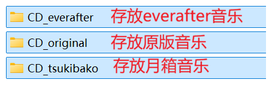

### ①添加音乐
原版音乐已在原版月姬根目录名为bgm的文件夹中，EVERAFTER和月箱的音乐请自行寻找(可以在这个[音乐网站](https://downloads.khinsider.com/game-soundtracks/album/ever-after-music-from-tsukime-reproduction)下载)，我个人非常推荐使用`EVERAFTER`的音乐\
进入音乐文件所在目录，创建一个后缀为`.txt`的文本文件，名字任意\
加入以下内容：
```
@echo off
setlocal enabledelayedexpansion
for %%f in (*.flac *.ogg *.wav *.mp3 *.ape) do (
  set "input=%%f"
  set "output=%%~nf.webm"
  ffmpeg.exe -i "!input!" -c:a libopus -b:a 96k -vbr on -mapping_family 0 -compression_level 10 -application audio -map_metadata -1 -f webm "!output!"
)
endlocal
pause
```
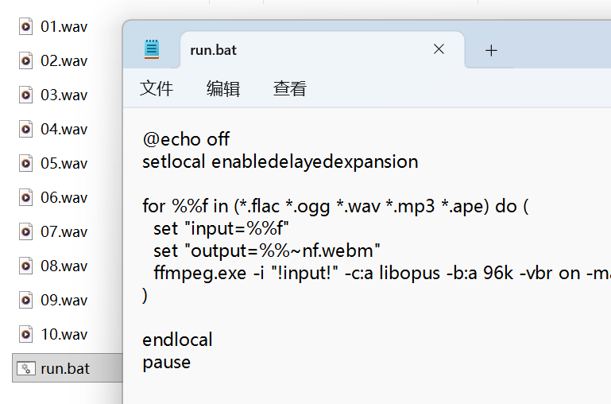
保存后将后缀改为.bat，双击运行\
运行完成后将得到压缩好的.webm音乐文件，将其名字按数字顺序改成以下形式，然后放入对应版本的音乐文件夹即可
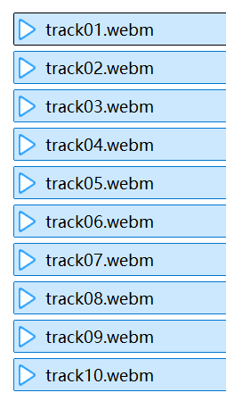
### ②添加音效
找到最开始解包原版月姬中的文件夹`wave`和解包PLUS-DISC中的文件夹`sound`
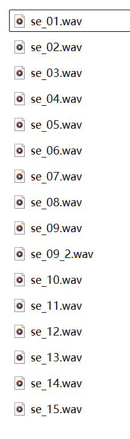
图中选中的名字中带有`plus_se`字样的文件是不需要的，可以删除。
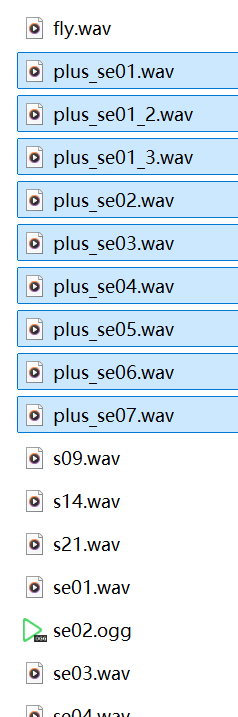
剩余文件按使用刚刚的`.bat`文件处理，压缩后不需要修改名字直接放入对应的音效文件夹

<font size=7>**至此，添加游戏内容的步骤已经大功告成了!!!**</font>\
ps：不知道你们累了没有，博主已经写累了。。。

# 三、编译
在tsukiweb项目的根目录下打开CMD，输入一下指令：
```
npm run build
```
等待完成即可\
完成后根目录出现的`dist`文件夹即为编译好的静态网站，可以部署在本地、服务器、Pages等平台
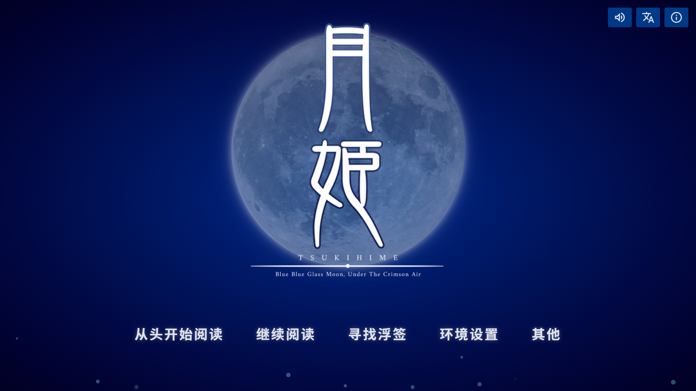